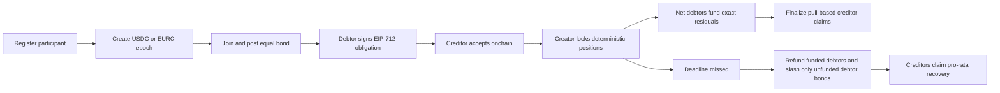

# NETFOLD

**Multilateral stablecoin obligation clearing on Arc Testnet.**

NETFOLD lets a bounded group record bilateral obligations, accept them onchain,
compute one deterministic net position per participant, and settle only the
residual stablecoin flow. It is a clearing protocol, not a donation page,
wallet, exchange, bridge, or lending market.

> Status: Arc Testnet prototype. The contracts are extensively tested but have
> not received an independent production audit. Do not use them with assets of
> real-world value.

## Why this exists

Crypto-native operators often owe each other money in both directions. Paying
every invoice independently creates repeated stablecoin transfers, additional
gas, and unnecessary working-capital pressure. NETFOLD preserves the accepted
obligation ledger while replacing gross settlement with exact residual funding.

For participant `p`:

```text
position[p] = incoming[p] - outgoing[p]

sum(position[p]) = 0
net settlement volume = sum(max(-position[p], 0))
liquidity saved = gross obligation volume - net settlement volume
```

The mandatory reference fixture is:

| From | To | Amount |
| --- | --- | ---: |
| A | B | 100 |
| B | C | 70 |
| C | A | 50 |
| C | D | 20 |
| D | B | 10 |
| B | A | 15 |

It produces:

| Metric | Result |
| --- | ---: |
| Gross volume | 265 |
| A | -35 |
| B | +25 |
| C | 0 |
| D | +10 |
| Residual settlement | 35 |
| Liquidity saved | 230 |

The TypeScript solver and Solidity contract independently produce the canonical
dataset hash:

```text
0xe7f3e6efd7eb10e17a6411e96c0e088f98466cfdccb9b73cd87e2ee92a93a243
```

## Protocol flow



## Contracts

### ParticipantRegistry

- Self-registration with a metadata hash.
- Participant-controlled metadata updates, deactivation, and reactivation.
- Pausing blocks new entries, not exits or metadata correction.
- Never receives or holds participant funds.

### ObligationBook

- EIP-712 debtor signatures with per-debtor nonces and deadlines.
- Explicit creditor acceptance or rejection.
- Replay protection through nonces and used digests.
- Bilateral cancellation before epoch lock.
- Reentrancy protection around clearinghouse callbacks.

### NetfoldClearinghouse

- One supported settlement token per epoch: Arc USDC or EURC.
- At most 64 unique participants and 256 accepted obligations per epoch.
- Equal entry bonds with no administrator withdrawal path.
- Exact net-debit funding and independent pull claims.
- Per-token liability accounting with a post-transfer solvency assertion.
- Deterministic default recovery; rounding dust goes to the highest-address
  creditor after canonical sorting.
- Pausing blocks new risk but never blocks claims, refunds, recoveries, or bond
  withdrawals.

## Trust and control

The administrator can pause new risk and manage role membership. The
administrator cannot:

- withdraw participant principal, claims, refunds, recoveries, or bonds;
- edit accepted obligations;
- change an epoch token;
- replace either Arc stablecoin address;
- reconfigure the obligation book after initial setup.

The prototype is not governance-minimized. A compromised pauser can delay new
activity, and a compromised admin can change role membership. Existing exit
paths remain callable. See [SECURITY.md](SECURITY.md) and
[docs/threat-model.md](docs/threat-model.md).

## Arc integration

| Item | Arc Testnet value |
| --- | --- |
| Chain ID | `5042002` |
| RPC | `https://rpc.testnet.arc.network` |
| Explorer | `https://testnet.arcscan.app` |
| USDC interface | `0x3600000000000000000000000000000000000000` |
| EURC | `0x89B50855Aa3bE2F677cD6303Cec089B5F319D72a` |
| Memo | `0x5294E9927c3306DcBaDb03fe70b92e01cCede505` |
| Multicall3From | `0x522fAf9A91c41c443c66765030741e4AaCe147D0` |
| Minimum max fee used by the UI | `20 gwei` |

Memo and Multicall3From are isolated behind an experimental adapter. They are
disabled in the product until the signed direct-EOA smoke script succeeds on
the target deployment. See [docs/arc-integration.md](docs/arc-integration.md).

## Application

The first screen is a protocol overview that explains the netting model with
the reference `265 USDC -> 35 USDC` settlement example. The clearing floor is
available at `/clearing` and includes:

- PixiJS obligation graph with gross and folded modes;
- D3 force layout and GSAP state transition;
- live Arc block, epoch, and contract reads through Wagmi/Viem;
- wallet transaction lifecycle: simulation, fee estimate, signature,
  submission, confirmation, and Arcscan proof;
- transaction session tape and canonical event index;
- dedicated obligations, epochs, funding, participant, activity, and protocol
  documentation routes;
- explicit empty, unconfigured, loading, and RPC failure states;
- no fabricated fallback data.

The graph uses a clearly labelled reference fixture for solver inspection. It
is never substituted for failed RPC data.

## Repository

```text
apps/web/                 Next.js clearing application
packages/contracts/       Foundry contracts, tests, scripts
packages/solver/          Deterministic TypeScript netting solver and CLI
packages/shared/          Arc config, schemas, and shared types
deployments/              Public deployment records only
docs/                     Architecture, security, and operating runbooks
```

## Local setup

Requirements:

- Node.js 22+
- pnpm 11+
- Foundry

```bash
pnpm install
cp .env.example .env
pnpm test
pnpm build
pnpm dev
```

The web app defaults to `http://localhost:3000`. It can run without deployed
contracts, but live contract actions and event indexing remain disabled until
all deployment addresses and `NEXT_PUBLIC_DEPLOYMENT_BLOCK` are configured.

Run the solver CLI:

```bash
pnpm --filter @netfold/solver build
node packages/solver/dist/cli.js obligations.json
```

Input amounts are integer token units. For Arc USDC and EURC, one token is
`1_000_000` units.

## Verification

Current local evidence:

| Check | Result |
| --- | --- |
| Foundry local unit, fuzz, invariant, differential | 100 passed, 0 failed |
| Arc fork checks | 4 passed, 0 failed |
| Fuzzing | 8 properties, 512 runs each |
| Invariants | 4 invariants, 128 runs and 8,192 calls each |
| TypeScript solver | 6 passed |
| Clearinghouse line coverage | 97.24% |
| ObligationBook line coverage | 87.84% |
| Registry line coverage | 96.88% |
| Slither application findings | 0 medium/high; expected timestamp/equality/complexity notes |
| Production dependency audit | 0 known vulnerabilities |

Coverage is generated with Foundry optimizer and IR disabled as required by its
coverage mode. Deployment bytecode is built with optimizer, 10,000 runs, and
`via_ir = true`.

```bash
pnpm test
pnpm lint
pnpm typecheck
pnpm build
pnpm audit:deps

forge test --root packages/contracts
forge coverage --root packages/contracts --report summary
slither packages/contracts --compile-force-framework foundry \
  --filter-paths "lib/|test/|script/"
```

## Deployment

The deployment script creates and permanently wires:

1. `ParticipantRegistry`
2. `ObligationBook`
3. `NetfoldClearinghouse`

```bash
forge script packages/contracts/script/Deploy.s.sol:DeployNetfold \
  --rpc-url "$ARC_RPC_URL" \
  --broadcast \
  -vvvv
```

Never commit `DEPLOYER_PRIVATE_KEY`. Record only public addresses, transaction
hashes, block number, ABI, compiler settings, and explorer links under
`deployments/`. Follow
[docs/deployment-runbook.md](docs/deployment-runbook.md) before broadcasting.

### Arc Testnet deployment

Deployed from `0xf6d02F13D7BB5fC24aB6A3D662619641958A3Cf6`:

| Contract | Address |
| --- | --- |
| ParticipantRegistry | `0xCab227dfaf88503Eb85a54FD5fc704fC21C534A0` |
| ObligationBook | `0xeE5fd63D152E1362499C332E8CcbF01134a68E0D` |
| NetfoldClearinghouse | `0xfd1bD9c625b617116FC65aA0386De5376Ed23ca0` |

The deployment began at block `52542421`. All five deployment and wiring
transactions finalized successfully. Exact hashes, gas usage, compiler
configuration, ABI artifact paths, and explorer URLs are recorded in
[`deployments/arc-testnet.json`](deployments/arc-testnet.json).

## Limits

- Testnet prototype, not independently audited.
- No production governance or timelock.
- No partial funding; each net debtor funds its exact residual once.
- No permissionless token support.
- Participant and obligation bounds are intentionally finite.
- Event indexing is browser-side and starts from the configured deployment
  block; it is not a hosted indexer.
- Stablecoin blocklist behavior is handled through pull claims but remains an
  external token policy risk.

## Documentation

- [Architecture](docs/architecture.md)
- [Protocol invariants](docs/protocol-invariants.md)
- [Threat model](docs/threat-model.md)
- [Arc integration](docs/arc-integration.md)
- [Deployment runbook](docs/deployment-runbook.md)
- [Verification report](docs/verification-report.md)

## License

MIT
