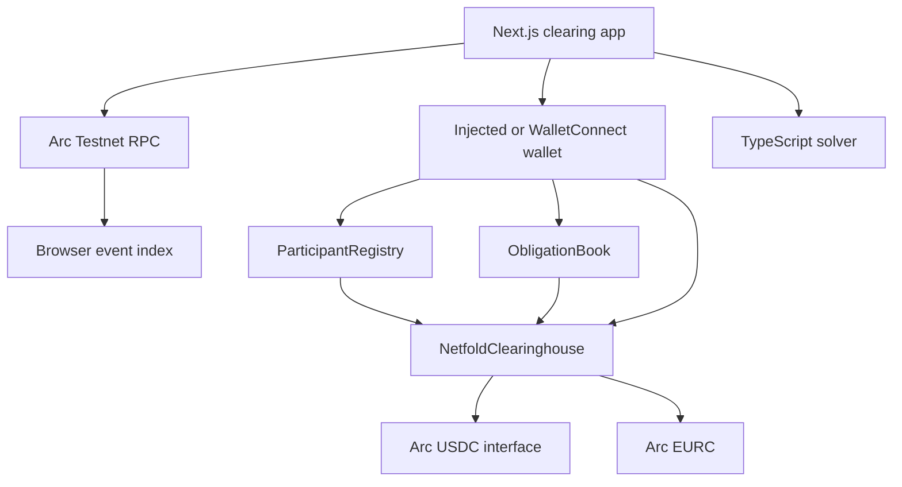
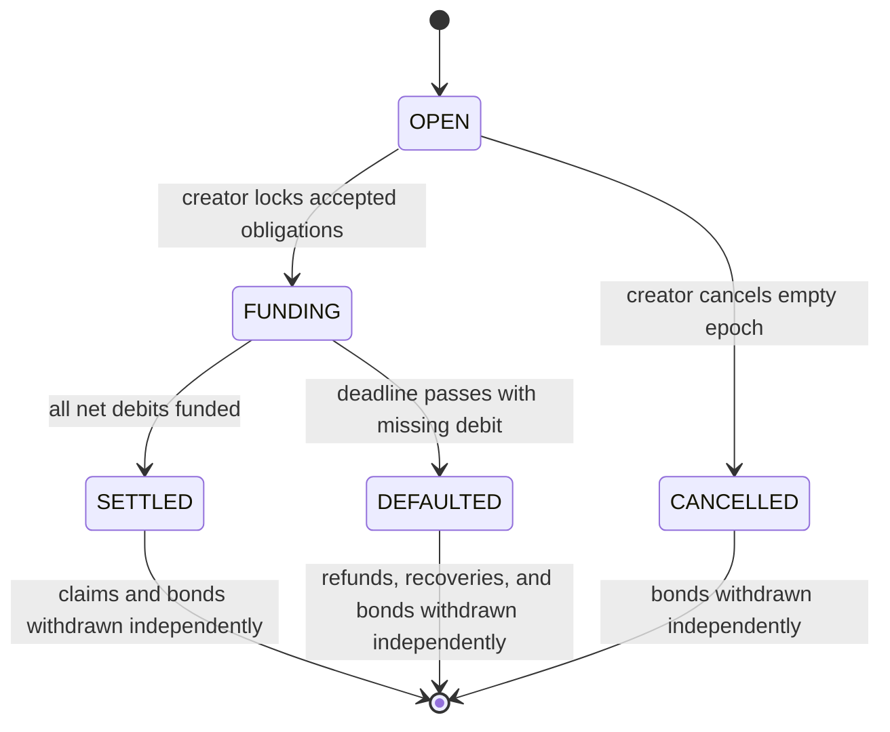

# Architecture

## System boundary

NETFOLD has four independently testable layers:

1. **Registry:** self-service identity pointers represented by hashes.
2. **Obligation book:** signed bilateral claims and explicit creditor consent.
3. **Clearinghouse:** epoch membership, positions, bonds, residual funding,
   settlement claims, and default recovery.
4. **Client and solver:** deterministic preview, transaction construction, live
   reads, event indexing, and wallet UX.

The Solidity clearinghouse is authoritative. The TypeScript solver is a
deterministic preview and differential test oracle, not a trusted settlement
executor.



## Data ownership

| Data | Authority | Mutability |
| --- | --- | --- |
| Participant metadata hash | Registry participant | Participant can update |
| Debtor nonce | ObligationBook | Increments on valid proposal |
| Obligation state | ObligationBook | Finite state machine |
| Epoch state | Clearinghouse | Finite state machine |
| Position | Clearinghouse | Accepted/cancelled obligations before lock |
| Dataset hash | Clearinghouse | Frozen at lock |
| Funding, claims, bonds | Clearinghouse | Pull accounting |
| Solver preview | Client | Informational only |
| Event index | Arc logs | Read-only projection |

## Epoch state machine



`LOCKED` is emitted as an intermediate checkpoint inside `lockEpoch`; the same
transaction opens funding and sets the deadline.

## Canonical positions

At lock:

1. Active participants are sorted by numeric EVM address.
2. Every accepted obligation contributes `-amount` to its debtor and `+amount`
   to its creditor.
3. Only addresses touched by accepted obligations enter the canonical packed
   stream, including net-zero participants.
4. Each row is `abi.encodePacked(address, int256 position)`.
5. `datasetHash = keccak256(concat(rows))`.

A participant with any accepted obligation cannot leave the epoch, even when
their net position is zero. This prevents the participant set and dataset hash
from diverging.

## Liability accounting

`totalLiability[token]` tracks every balance owed by the clearinghouse:

- active bonds;
- funded net-debit principal;
- settlement claims;
- default refunds;
- default recovery claims.

Every incoming transfer increases liability after receipt. Every withdrawal
reduces liability before transfer. The contract checks:

```text
token.balanceOf(clearinghouse) >= totalLiability[token]
```

The administrator has no general token transfer or rescue function.

## Frontend behavior

The client separates three data classes:

- **Live contract reads:** canonical and never replaced by fixtures.
- **Wallet session state:** simulation and transaction lifecycle for the
  current browser.
- **Reference fixture:** clearly labelled solver example used by the graph and
  documentation.

RPC failures render an error state. Missing deployment configuration renders an
unconfigured state. Neither path fabricates live epochs or activity.

## Operational bounds

The clearinghouse caps each epoch at 64 unique historical participants and 256
accepted obligations. Unique-history bounds prevent repeated leave/rejoin from
growing arrays without limit. Insertion sorting is acceptable under the
participant cap and creates deterministic order without offchain trust.
